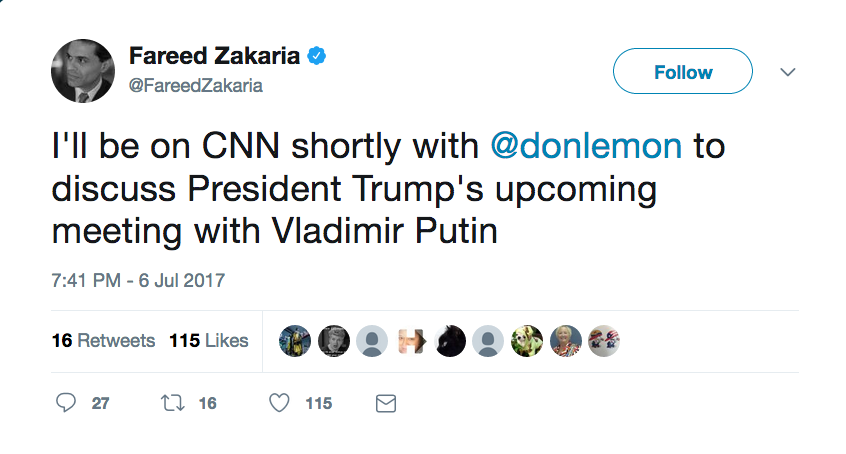

## TV-Searcher

This project is an open ended exploration into television appearances. Right now, I'm starting with self-promoting tweets, as below:

### Long term project goals 

1. Develop some model for determining whether or not a tweet actually promotes a TV appearance (and improve query choice through modeling) 
2. Reconstruct a TV guide through these tweets
3. Incorporate other data sources
4. Develop some graphical interface to present these tweets
