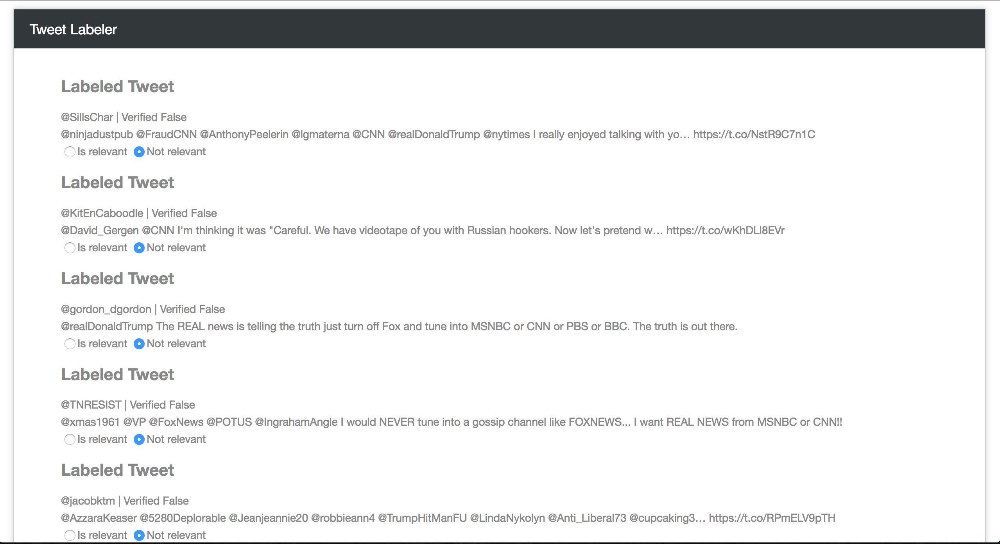

## Labeling process

This is a simple http server to provide an interface to manually label tweets as relevant or not. Here's an example of what this interface looks like - the labeler is not yet set up to prescreen at all, so there's a lot of trash that I'm filtering through.

